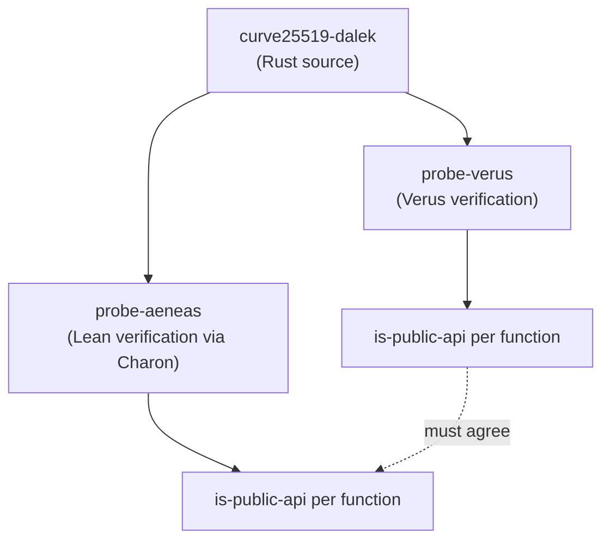
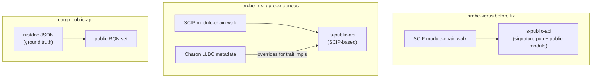
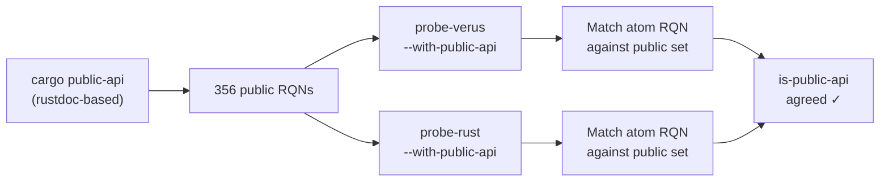

# Aligning `is-public-api` across probe tools

---

## Slide 1 — Why `is-public-api` matters

A crate's **public API** is the contract with its users.
When a team claims "this crate is formally verified", the consumer
of that crate cares about one thing:

> Are the functions **I can call** verified?

Internal helpers, private modules, and compiler-generated glue are
implementation details. The consumer cannot call them and does not
need assurance about them.

`is-public-api` answers exactly this: it marks every function that
is reachable from outside the crate boundary.

---

## Slide 2 — From `is-public-api` to a verification attestation

A verification report partitions the public API into three buckets:

```
┌─────────────────────────────────────────────┐
│              Public API (186)               │
├──────────────┬────────────┬─────────────────┤
│  Verified    │  Trusted   │  Out-of-scope   │
│  (149)       │  (10)      │  (27)           │
│              │            │  cfg-gated,     │
│  Proved by   │  Axioms or │  external,      │
│  the solver  │  external  │  not compiled   │
│              │  bodies    │  during verify  │
└──────────────┴────────────┴─────────────────┘
```

An **attestation** can then state:

- **149 / 186** public API functions are machine-verified.
- **10** rely on trusted assumptions (listed explicitly).
- **27** are out of scope (cfg-gated features, bodyless trait decls).
- **0** are unverified — no gaps in coverage.

Without accurate `is-public-api`, these numbers are wrong:
overcount inflates confidence, undercount hides real coverage.

---

## Slide 3 — The cross-tool alignment problem

Two independent verification pipelines analyze the same crate:



If the tools disagree on which functions are public API,
a combined report (e.g., "Verus covers 80% of public API,
Lean covers 60%") becomes incoherent — the denominators differ.

For any Rust crate, `is-public-api` should be **identical** across probe
tools for every function both tools discover.

---

## Slide 4 — The matching key: `rust-qualified-name`

To compare atoms across tools, we need a shared key.
`rust-qualified-name` (RQN) serves this role:

```
curve25519_dalek::edwards::EdwardsPoint::add
```

Both tools derive it from:

```
RQN = derive_rust_qualified_name(code_path, display_name)
```

If either `code_path` or `display_name` differs between tools,
the RQNs diverge and matching fails silently.

---

## Slide 5 — Problem 1: SCIP symbol format mismatch

rust-analyzer and verus-analyzer emit **different SCIP symbol formats**
for trait impl methods:

```
rust-analyzer:   impl#[EdwardsPoint][Add]add().     (two #s, Self type present)
verus-analyzer:  edwards/Add#add().                  (one #, Self type MISSING)
```

`enrich_display_name` extracts the Self type from the text before the
first `#`. With verus-analyzer's single-hash format, it mistakes the
**trait name** for the Self type:

```
rust-analyzer  → display_name = "EdwardsPoint::add"   ✓
verus-analyzer → display_name = "Add::add"             ✗
```

**Impact**: ~184 trait impl atoms got wrong display names, producing
wrong RQNs, causing `cargo public-api` matching to fail for all of them.

**Fix**: Re-enrich the display name after resolving `self_type` from the
SCIP self-parameter pre-pass (P21).

---

## Slide 6 — Problem 2: code-path prefix and RQN derivation

`derive_rust_qualified_name` expects `crate-name/src/path.rs` format
and splits on `/src/` to extract the crate name.

For **workspace** projects (probe-aeneas's typical setup):

```
pkg_root = /workspace/curve25519-dalek/
project  = /workspace/
prefix   = "curve25519-dalek"
SCIP path: src/edwards.rs
code_path: curve25519-dalek/src/edwards.rs    → split on /src/ works ✓
```

For **non-workspace** projects (probe-verus's typical setup):

```
pkg_root = /project/curve25519-dalek/
project  = /project/curve25519-dalek/
prefix   = ""  (same directory)
SCIP path: src/edwards.rs
code_path: src/edwards.rs                     → no /src/ to split on ✗
```

**Impact**: All RQNs were `null` for non-workspace projects.

**Fix**: Use the package name from Cargo.toml as the RQN prefix,
while keeping `code-path` output relative to the project root.

---

## Slide 7 — Problem 3: three sources of truth for public API

Each tool had a different mechanism for `is-public-api`:



| Source | Trait impl `Add::add` on public type | Problem |
|--------|--------------------------------------|---------|
| SCIP module walk | `is-public: false` (no `pub` keyword) | Misses all trait impls |
| Charon LLBC | `is-public: true` (knows impl is public) | Only available in probe-rust with `--with-charon` |
| `cargo public-api` | Listed as public | Ground truth, but needs RQN matching |

**Result**: probe-verus reported 101 public API functions,
probe-aeneas reported 167 — a gap of 66, mostly trait impls.

---

## Slide 8 — The solution: `cargo public-api` as shared ground truth



Both tools:
1. Run `cargo public-api` on the same crate
2. Parse output into a set of public RQNs
3. Override `is-public-api` for atoms whose RQN is in the set

**Prerequisites** (all had to be fixed first):
- Display names must use `SelfType::method`, not `TraitName::method` (Slide 3)
- code-path must produce valid RQNs for non-workspace projects (Slide 4)
- RQN derivation algorithm must be identical across tools (P21)

---

## Slide 9 — Results on curve25519-dalek

| Metric | Before | After |
|--------|-------:|------:|
| Atoms with RQN | 0 | 710 |
| Atoms matched against `cargo public-api` | 0 | 421 |
| `is-public-api` overridden | 0 | 43 |
| Public API total | 126 (inflated) | 186 (accurate) |

The 186 public API functions partition cleanly:

| Category | Count |
|----------|------:|
| Verified | 149 |
| Trusted | 10 |
| Out-of-scope (cfg-gated, external, bodyless) | 27 |
| **Total** | **186** |

---

## Slide 10 — Properties established

| Property | Description |
|----------|-------------|
| **P21** | Cross-tool RQN alignment: same algorithm, `SelfType::method` for trait impls, `crate-name/src/...` paths |
| **P22** | Cross-tool trust-reason vocabulary: canonical categories with per-tool mapping |

Both are documented in `probe/kb/engineering/properties.md` and
enforced by `tests/public_api_alignment.rs`.
